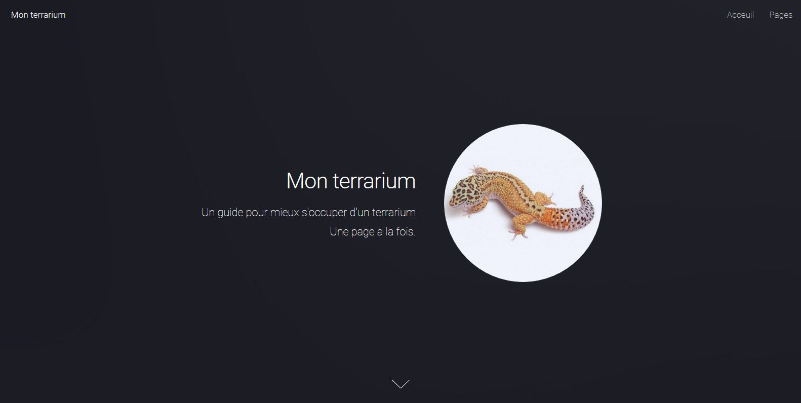

# Mon Terrarium, a website to make terrarium keeping easy
This is my website project, , created in grade 10 (available in french only). It's goal was to make keeping a terrarium easy, while improving my web programming skills at the same time. I enjoyed making this site, and I hope you will enjoy looking at it too !

I am trying to make the process of sharing my website easier by using Github Pages and learning new stuff through that process, so if you have any suggestion, I am always open to hear them.

  <a href="acceuil.html"> Home </a>

# Mon Terrarium, un site web pour rendre la terrariophilie facile
Ceci est mon projet de site web, créé en 10e année. Son but était de faciliter la gestion d'un terrarium, tout en améliorant mes compétences en programmation web. J'ai pris beaucoup de plaisir à faire ce site, et j'espère que vous aurez aussi plaisir à le regarder !

J'essaie de rendre le processus de partage de mon site plus facile en utilisant les pages Github et en apprenant de nouvelles choses grâce à ce processus, donc si vous avez des suggestions, je suis toujours ouvert à les entendre.

  <a href="acceuil.html"> Acceuil </a>

# Preview

  Here's a preview :

# Credits
Paradigm Shift by HTML5 UP. Free for personal and commercial use under the CCA 3.0 license : [html5up.net/license](html5up.net/license)

[HTML5UP](html5up.net) | [@ajlkn](https://twitter.com/ajlkn)

See the [license](LICENSE.md) for more information.
